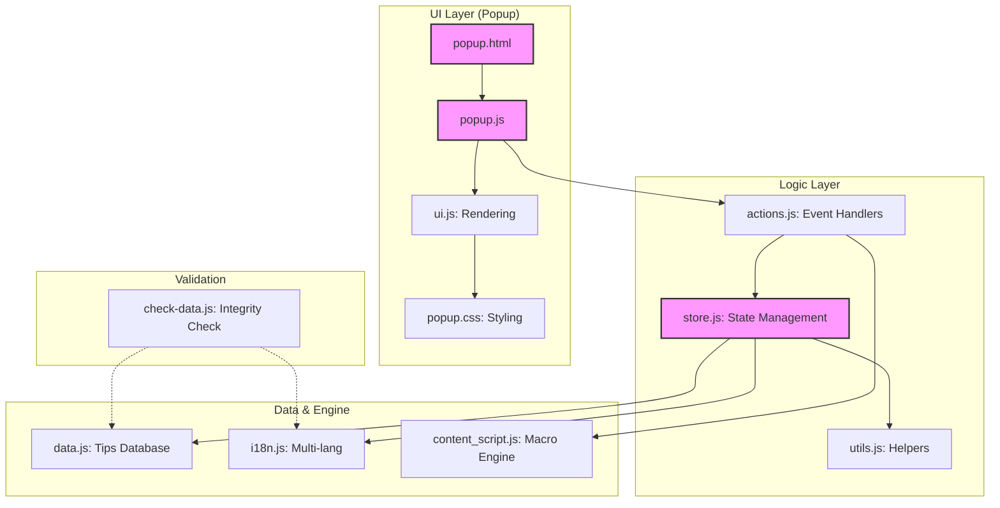

# 🚀 My Chrome Guide: Extension 프로젝트 상세 가이드

본 프로젝트는 사용자가 크롬 브라우저를 더욱 스마트하게 사용할 수 있도록 돕는 **학습형 팁 큐레이션 및 웹 자동화 확장 프로그램**입니다. 단순한 정보 제공을 넘어, 사용자 활동에 따른 점수 시스템과 복잡한 반복 작업을 줄여주는 매크로 기능을 포함하고 있습니다.

---

## 🏗 시스템 아키텍처 (System Architecture)

프로젝트는 모듈형 자바스크립트 구조를 채택하여 유지보수성과 확장성을 극대화했습니다. `AppStore`를 중심으로 모든 상태가 관리되며, 각 모듈은 단일 책임 원칙(SRP)을 따릅니다.



---

## 🌟 핵심 기능 (Core Features)

| 기능 | 설명 | 아이콘 (SVG) |
| :--- | :--- | :---: |
| **팁 큐레이션** | 14개의 카테고리로 분류된 120+개의 크롬 활용 팁 제공 | <svg width="20" height="20" viewBox="0 0 24 24"><path fill="currentColor" d="M12 2L4.5 20.29l.71.71L12 18l6.79 3l.71-.71z"/></svg> |
| **활동 점수(pt)** | 조회, 가이드 확인, 즐겨찾기 등 활동 시 점수 누적 | <svg width="20" height="20" viewBox="0 0 24 24"><path fill="currentColor" d="M12 17.27L18.18 21l-1.64-7.03L22 9.24l-7.19-.61L12 2L9.19 8.63L2 9.24l5.46 4.73L5.82 21z"/></svg> |
| **1클릭 매크로** | 자주 방문하는 사이트의 특정 버튼 클릭/입력을 자동화 | <svg width="20" height="20" viewBox="0 0 24 24"><path fill="currentColor" d="M13 10V3L4 13h7v7l9-10z"/></svg> |
| **스마트 메모** | 각 팁에 대해 사용자만의 메모를 기록하고 보관 | <svg width="20" height="20" viewBox="0 0 24 24"><path fill="currentColor" d="M3 17.25V21h3.75L17.81 9.94l-3.75-3.75L3 17.25zM20.71 7.04c.39-.39.39-1.02 0-1.41l-2.34-2.34c-.39-.39-1.02-.39-1.41 0l-1.83 1.83 3.75 3.75 1.83-1.83z"/></svg> |

---

## ⚡ 매크로 실행 흐름 (Macro Execution Flow)

사용자가 매크로를 실행하면 `content_script.js` 엔진이 웹 페이지의 DOM을 분석하여 정의된 동작을 수행합니다.

```mermaid
sequenceDiagram
    participant U as User
    participant P as Popup (actions.js)
    participant S as Store (store.js)
    participant C as Content Script (Engine)
    participant D as Web Page (DOM)

    U->>P: 매크로 실행 버튼 클릭
    P->>S: 실행 기록 저장 (+10pt)
    P->>C: 메시지 전송 (runMacro)
    Note over C: 엔진 가동 (MutationObserver)
    loop 각 단계별 반복
        C->>D: 요소 검색 (findAndClick / findAndFill)
        alt 요소를 찾음
            D-->>C: 요소 반환
            C->>D: 클릭 또는 텍스트 입력 수행
            C->>U: 상태 배지 업데이트 (Step N/M)
        else 요소를 못 찾음 (재시도)
            C->>C: 지수 백오프 대기
        end
    end
    C->>U: 완료 알림 및 배지 제거
```



---

## 📊 데이터 정합성 검증 로직

`check-data.js`는 배포 전 데이터의 오류를 찾아내는 파수꾼 역할을 합니다.

> <svg width="16" height="16" viewBox="0 0 24 24" style="vertical-align:middle"><path fill="#e91e63" d="M12 2C6.48 2 2 6.48 2 12s4.48 10 10 10 10-4.48 10-10S17.52 2 12 2zm1 15h-2v-2h2v2zm0-4h-2V7h2v6z"/></svg> **데이터 무결성 원칙**:
> 1. 모든 `id`는 고유해야 합니다. (중복 금지)
> 2. `data.js`의 모든 카테고리는 `i18n.js`에 번역이 존재해야 합니다.
> 3. 모든 자바스크립트 파일은 문법적 결함(Bracket Mismatch)이 없어야 합니다.

---

## 🛠 기술 스택 (Tech Stack)

*   **Frontend**: Vanilla JS, CSS3 (Custom Variables), HTML5
*   **State Management**: Custom `AppStore` (Chrome Storage Local API Wrapper)
*   **Automation**: MutationObserver, Element Selector Engine
*   **Tooling**: Node.js (Data Validator)

---

## 📂 주요 파일 구조

```text
/
├── manifest.json         # 확장 프로그램 메타데이터 및 권한 설정
├── popup.html            # 메인 UI 레이아웃
├── popup.js              # 엔트리 포인트 및 초기화 로직
├── content_script.js     # 웹 페이지 제어 자동화 엔진
├── check-data.js         # 데이터 무결성 검사 도구 (Node.js)
└── js/
    ├── store.js          # 중앙 상태 관리 (AppStore)
    ├── actions.js        # 비즈니스 로직 및 이벤트 핸들러
    ├── ui.js             # DOM 조작 및 렌더링 엔진
    ├── i18n.js           # 다국어(KO/EN) 및 카테고리 설정
    ├── data.js           # 120개 이상의 팁 데이터베이스
    └── constants.js      # 시스템 상수 및 설정값
```

---

## 📈 활동 점수 시스템 (Engagement Score)

단순 조회가 아닌, 실제 활용도에 따라 가중치를 부여하여 통계를 산출합니다.

| 활동 유형 | 가중치 | 설명 |
| :--- | :---: | :--- |
| **단순 클릭** | 1pt | 팁의 요약 내용을 확인했을 때 |
| **가이드 확인** | 3pt | "상세 단계 보기"를 클릭하여 학습했을 때 |
| **즐겨찾기** | 5pt | 나중에 보기 위해 보관함에 추가했을 때 |
| **매크로 실행** | 10pt | 자동화 기능을 실제로 사용하여 시간을 절약했을 때 |

---
최종 업데이트: 2026-03-26  
제작: Gemini CLI & my-chrome-guide Team
