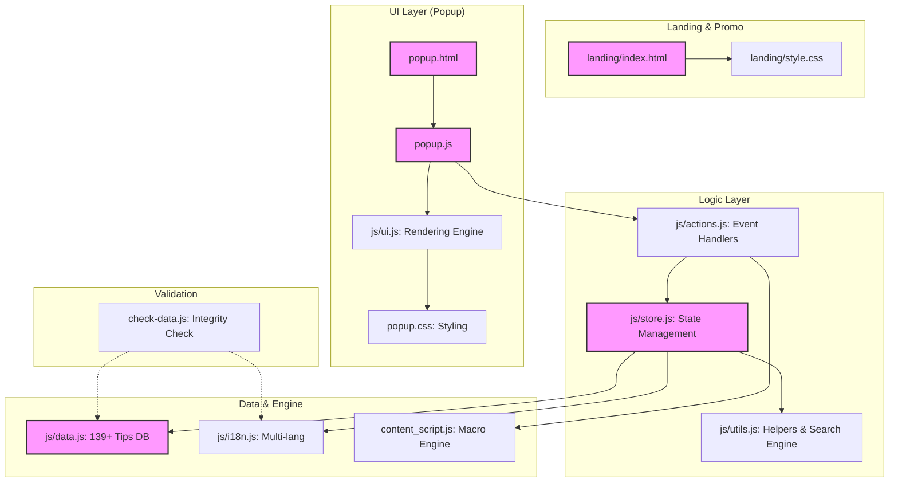

# 🚀 My Chrome Guide: Extension 프로젝트 상세 가이드 (v2.2)

본 프로젝트는 사용자가 크롬 브라우저를 더욱 스마트하게 사용할 수 있도록 돕는 **학습형 팁 큐레이션 및 웹 자동화 확장 프로그램**입니다. v2.2에서는 검색 엔진 고도화(퍼지 매칭, 다중 키워드)와 대규모 데이터셋(139+ 팁)에 최적화된 UX를 포함하고 있습니다.

---

## 🏗 시스템 아키텍처 (System Architecture)

프로젝트는 모듈형 자바스크립트 구조를 채택하여 유지보수성과 확장성을 극대화했습니다. `AppStore`를 중심으로 모든 상태가 관리되며, 성능 최적화를 위해 **Lazy Loading**과 **State Caching** 기법이 적용되었습니다.



---

## 🌟 핵심 기능 (Core Features)

| 기능 | 설명 | 상태 |
| :--- | :--- | :---: |
| **팁 큐레이션** | 15개 카테고리로 분류된 **139가지** 크롬 활용 팁 | ✅ Ver 2.2 |
| **지능형 검색** | **다중 키워드** 및 **퍼지 매칭(Levenshtein)** 기술로 오타에도 대응하는 검색 구현 | ✅ Advanced |
| **1클릭 매크로** | 네이버 메일, 구글 드라이브 등 반복 작업 자동화 엔진 | ✅ Stable |
| **스마트 메모** | 각 팁의 선택 위치에 동적으로 나타나는 컨텍스트 기반 메모 | ✅ Improved |
| **고급 생산성 가이드** | 최신 AI(Gemini)와 보안(Passkeys) 기능을 포함한 전문가 노하우 | ✅ Updated |

---

## ⚡ 주요 성능 및 UX 최적화 (Optimization)

1.  **Memoized Lazy Loading**: `store.js`에서 데이터 로드 시 초기 부하를 제거하여 팝업 실행 속도를 개선했습니다.
2.  **Fuzzy Search Engine**: `utils.js`의 편집 거리(Levenshtein) 알고리즘을 활용하여 사용자 검색 의도를 정확히 파악합니다.
3.  **Modern "No Results" UI**: 검색 결과가 없을 때 추천 키워드(Suggestion Chips)를 제공하여 탐색 중단을 방지합니다.
4.  **Render Limit Control**: `ui.js`에서 렌더링 아이템 수를 제한하여 대량 데이터에서도 60fps 수준의 반응성을 유지합니다.

---

## 📊 데이터 정합성 검증 (`check-data.js`)

배포 전 `node check-data.js`를 실행하여 다음 사항을 자동 검증합니다.

1.  **ID 고유성**: 모든 팁의 ID 중복 여부 체크.
2.  **필수 필드**: `title`, `desc`, `category`, `steps` 등 누락 여부.
3.  **연관 팁 유효성**: `related`에 지정된 ID가 실제로 존재하는지 검증.
4.  **다국어 정합성**: 한국어와 영어 데이터의 수량 및 카테고리 일치 여부.
5.  **태그 일관성**: 한/영 `tags` 배열 길이 일치 여부 검사 (현재 ⚠️ 주의 필요).

---

## 📂 주요 파일 구조

```text
/
├── manifest.json         # 확장 프로그램 메타데이터
├── popup.html            # 메인 UI 레이아웃
├── popup.js              # 엔트리 포인트 및 초기화
├── content_script.js     # 자동화 매크로 엔진
├── check-data.js         # 데이터 무결성 검사 도구 (Node)
├── landing/              # 화이트 테마 홍보 랜딩 페이지
└── js/
    ├── store.js          # 중앙 상태 및 지연 로딩 로직
    ├── actions.js        # 비즈니스 로직 및 이벤트
    ├── ui.js             # 렌더링 엔진 (Render Limit 및 검색 UI 포함)
    ├── i18n.js           # 다국어 메시지 및 카테고리
    ├── data.js           # 139개 팁 데이터베이스
    └── utils.js          # 공통 유틸리티 (퍼지 검색 알고리즘 포함)
```

---

최종 업데이트: 2026-03-30  
제작: Antigravity Team
